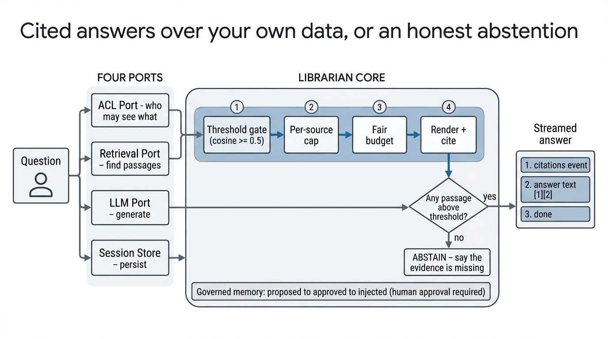

# AI Librarian for Database

## PART 1 — FOR HUMANS



### Abstract

Applications with research notebooks, project records, or other user-authored corpora often add retrieval-augmented generation by placing a language model in front of a search index. That is insufficient when the corpus is multi-user, documents contain several topics, and an answer must distinguish evidence in the application’s records from general knowledge. AI Librarian for Database is a portable Python core for that setting. It retrieves authorised chunks from the host application’s own schema, admits them only above a similarity threshold, supplies citation-addressable excerpts to the model, and instructs the model not to claim unsupported facts about the user’s records. When retrieval cannot provide usable evidence, the system deliberately withholds corpus-specific claims while still allowing clearly general expert help. The core is organised around four small integration ports—retrieval, access control, language model streaming, and conversation storage—and has no runtime dependencies. Its turn and memory rules make streamed failures, persistence, authorisation, and human-approved long-term context explicit rather than incidental.

### Background

Naive RAG tends to fail where the corpus and users are real rather than curated. Document-level rank-fusion scores are rank-based and structurally flat: neighbouring results can have nearly identical values, so there is no meaningful threshold at which to stop citing. A threshold over chunk-level cosine similarity is usable because it represents similarity and points to the relevant excerpt. Whole documents are also poor evidence units: a long notebook entry can cover unrelated topics, while a citation needs the precise chunk that supports the claim.

Retrieval alone does not prevent fabrication. The prompt separates facts about the user’s records—which must come from retrieved passages and use their citation numbers—from general domain knowledge, which may be offered as general knowledge. It also tells the model not to conflate values from neighbouring documents or entities. If no passage clears the threshold, the model is told not to invent document-specific facts.

Operational failure states matter too. A provider error after text has reached the client is not evidence that the answer failed; marking it failed lies to the user. Conversely, an error event discarded by an SSE consumer hides the diagnosable provider message. The turn therefore records whether any text was emitted, and SSE represents errors as named events.

### Method

#### Four ports, your schema

The core knows no ORM, web framework, vector database, or provider SDK. Adopt it by implementing four contracts against the application you already have:

| Port | Responsibility | Included implementation |
|---|---|---|
| `RetrievalPort` | Return authorised, scored source chunks | `PgVectorRetrieval` |
| `ACLPort` | Resolve an application user to a scoped `Principal` | `SingleUserACL`, `TenantACL` |
| `LLMPort` | Stream model text and provider errors | `OpenAICompatLLM`, `CallableLLM` |
| `SessionStorePort` | Persist sessions and ordered messages | `SQLAlchemySessionStore` |

Retrieval applies the ACL in the adapter query, not after rows have been returned. In a scoped deployment, an empty `Principal.scope_ids` means no readable containers, never an unfiltered corpus.

#### Retrieval and abstention

For a question, the core asks the retrieval port for candidate chunks at `min_similarity`. The adapter must return descending, comparable scores already filtered at that floor. The core then applies the pipeline:

`threshold gate → per-source cap → fair context budget → abstain`

The per-source cap prevents one large, multi-topic document from occupying every passage slot. Rendering shares the context-character budget across selected passages so an early long chunk cannot starve later evidence. Each surviving passage receives a citation number, and citations are emitted before answer text. If no chunk survives—or retrieval fails—the turn has no corpus evidence and injects an abstention instruction: it must not claim specifics from the user’s documents, though it may give labelled general knowledge.

#### Streaming turn rules

The turn creates and commits the assistant’s `streaming` message before it starts streaming, so a concurrent thread read can see the turn. It finalises and commits that row in the generator’s `finally` block, including when the consumer disconnects. A fallback model is attempted only if the primary produces an error before any text; switching models after output would splice two answers together. A turn is stored as errored only if it emitted no text. Named SSE error events carry the real provider message when there was no answer.

#### Governed memory

Memory is optional and not automatic prompt context. A proposal begins as `proposed`; only `active` memories are injectable. Approval checks provenance for non-exempt types: at least one source needs an identifier and a verbatim excerpt of 12 or more characters. By default, the proposer cannot approve their own memory. Active memories are ranked and sanitised before being put in a bounded, untrusted memory section; rejected, superseded, expired, and tombstoned memories are not injected.

### Workflow

The five steps below are the manual path. If you use Claude Code, the guided
installer does steps 1–3 for you — see [Guided installation](#guided-installation)
after this section.

#### 1. Install

The core itself has no runtime dependencies. Install the adapters you need, or all included adapters:

```bash
pip install "ai-librarian-for-database[all] @ git+https://github.com/Key-man-fromArchive/AI-librarian_for_database"
```

For a checkout instead:

```bash
pip install -e ".[all]"
```

#### 2. Wire the adapters to existing data

Start with access control, then retrieval. The pgvector adapter is configured with your existing chunk table; it does not create a parallel document schema.

```python
from librarian_adapters.pgvector_retrieval import ChunkTableSpec, PgVectorRetrieval
from librarian_adapters.sqlalchemy_store import SQLAlchemySessionStore
from librarian_adapters.openai_compat_llm import OpenAICompatLLM
from librarian_core import LibrarianConfig, LibrarianTurn

retrieval = PgVectorRetrieval(
    db,
    ChunkTableSpec(
        table="document_chunks",
        embedding_column="embedding",
        text_column="chunk_text",
        source_id_column="document_id",
        title_column="title",
        chunk_index_column="chunk_index",
        tenant_column="org_id",       # use None only for a single-tenant schema
        scope_column="folder_id",     # use None when there is no container ACL
        scope_name_column="folder_name",
        extra_where="deleted_at IS NULL",
    ),
    embed=my_embedding_function,
)

turn = LibrarianTurn(
    store=SQLAlchemySessionStore(db),
    llm=OpenAICompatLLM(api_key_env="OPENAI_API_KEY"),
    retrieval=retrieval,
    config=LibrarianConfig(answer_model="gpt-4o"),
)
```

Use the same embedding model for queries that created the stored vectors. If you already have a model router, use `CallableLLM` rather than replacing it. Full porting guidance is in [docs/PORTING.md](docs/PORTING.md).

#### 3. Migrate the session tables

The SQLAlchemy adapter exposes its own metadata so its two tables can join your migration target metadata:

```python
from librarian_adapters.sqlalchemy_store import LibrarianBase

target_metadata = [YourBase.metadata, LibrarianBase.metadata]
```

Generate and review the migration through your application’s normal migration process, then apply it. With Alembic, the application command is:

```bash
alembic upgrade head
```

#### 4. Tune on a goldset

Create 10–15 questions against your own corpus, name the expected source IDs, and include `must_abstain: true` questions with no correct source. Copy the structure in [eval/goldset.synthetic.json](eval/goldset.synthetic.json). Run the real retrieval implementation, not the built-in lexical demonstration:

```bash
python3 eval/run_eval.py \
  --goldset eval/your_goldset.json \
  --retrieval your_package.librarian:make_retrieval \
  --sweep 0.4,0.45,0.5,0.55
```

Read `recall@k` and `abstain` together. Lowering the threshold can retrieve irrelevant chunks; raising it can abstain on answerable questions. The default `min_similarity` is a starting point, not a result for a different corpus.

#### 5. Deploy

Run the same migration and test commands in the deployment pipeline, provide provider credentials through the deployment environment, and mount `build_librarian_router` if the included FastAPI surface matches your API conventions. The router creates, lists, reads, soft-deletes sessions, and streams turns; custom applications can call `LibrarianTurn` directly.

```bash
pytest
python3 tools/scan_secrets.py
```

### Guided installation

The repository ships a Claude Code skill that performs steps 1–3 against an
existing project. Its defining behaviour is that it **inspects before it asks**:
it reads the schema, checks whether pgvector is installed, finds the migration
tool, and looks for an existing tenancy model — then asks only what inspection
could not settle, presenting what it found as the default.

```bash
cp -r skills/ai-librarian ~/.claude/skills/
```

Then, in the target project: *"install the AI librarian"*. It proposes the
knowledge source from your actual tables, writes the adapters and migration for
your schema, and finishes by tuning the threshold on a goldset of your own
questions. It refuses to invent a table it could not find. See
[skills/ai-librarian/SKILL.md](skills/ai-librarian/SKILL.md).

### Try it before adopting it

A complete librarian runs in one file with no database, no API key and no
network access:

```bash
pip install -e ".[fastapi]" uvicorn
uvicorn examples.minimal_fastapi.app:app --port 8000
```

It is worth watching two things in the stream: the `event: citations` block
arrives *before* any answer text, and a question the corpus cannot answer
produces an abstention rather than an invented value. Those are the two
behaviours the rest of this README is about. See
[examples/minimal_fastapi/app.py](examples/minimal_fastapi/app.py).

### Publishing code derived from private data

`tools/scan_secrets.py` checks credentials, personal data and internal
infrastructure identifiers, and runs in CI on every push and pull request.

It exists because extracting this project from its origin codebase nearly
published three things: an evaluation goldset containing real product
formulations, a colleague's name used as an example inside a docstring, and
internal hostnames in configuration defaults. None of the three was
key-shaped, so a credential scanner would have passed all of them. If you
extract a librarian from your own private system, the same categories are the
ones to check.

```bash
python3 tools/scan_secrets.py            # working tree
python3 tools/scan_secrets.py --staged   # pre-commit
git config core.hooksPath .githooks      # enable the shipped hook
```

### Who should and should not use this

Use this when you have an existing Python application with a corpus you already own, an access model you can express as tenant and container scope, and a need to answer from user-visible records with traceable excerpts. It is especially suited to research notebooks, project documentation, operational logs, and similar multi-user data where an unsupported citation is worse than an admitted gap.

Do not adopt it for a public-web research agent, a frontend component library, reranking, or autonomous multi-step investigation: those are not included. Do not use the supplied `SingleUserACL` for a shared database. Do not use raw rank-fusion scores as the retrieval score, whole-document vectors as a substitute for chunks, or a retrieval adapter that filters permissions after fetching rows. If you cannot supply a trustworthy ACL, comparable chunk scores, and an ordered conversation store, this package does not remove that work; it makes the missing integration explicit. The shipped adapters are Python, SQLAlchemy, FastAPI, OpenAI-compatible HTTP, and pgvector-oriented; other stacks need implementations of the ports.

## PART 2 — FOR AI AGENTS

This section is the modification and installation contract. Read the named source before changing the associated behaviour. Do not infer host schema, ACL policy, provider configuration, or migration tooling.

### File → responsibility map

| Path | Responsibility |
|---|---|
| `src/librarian_core/ports.py` | Value objects and the four integration protocols |
| `src/librarian_core/config.py` | Immutable turn, retrieval, generation, and memory tunables |
| `src/librarian_core/rag.py` | Scope detection; retrieval call; per-source selection; passage rendering |
| `src/librarian_core/prompts.py` | Default policy, grounded prompt, abstention prompt, untrusted passage boundary |
| `src/librarian_core/turn.py` | Session writes, history, prompt assembly, SSE streaming, fallback, finalisation |
| `src/librarian_core/sse.py` | SSE encoding, headers, and named-error extraction |
| `src/librarian_core/memory/models.py` | Memory statuses, transitions, provenance and revision value objects |
| `src/librarian_core/memory/governance.py` | Proposal, approval, lifecycle validation, provenance, expiry, supersession |
| `src/librarian_core/memory/context.py` | Injectable-memory ranking, sanitisation, and bounded rendering |
| `src/librarian_adapters/acl.py` | Single-user and tenant/container `Principal` resolution |
| `src/librarian_adapters/pgvector_retrieval.py` | pgvector cosine retrieval with tenant and scope predicates in SQL |
| `src/librarian_adapters/openai_compat_llm.py` | OpenAI-compatible HTTP streaming and callable-router adapter |
| `src/librarian_adapters/sqlalchemy_store.py` | SQLAlchemy session/message schema and store implementation |
| `src/librarian_adapters/fastapi_router.py` | Optional FastAPI session and SSE endpoints |
| `eval/run_eval.py` | Retrieval-only goldset evaluation and threshold sweep |
| `skills/ai-librarian/SKILL.md` | Guided installer: inspect the host project, then generate adapters |
| `examples/minimal_fastapi/app.py` | Runnable reference wiring with in-memory stubs |
| `tools/scan_secrets.py` | Pre-publication scan for credentials, personal data, internal hosts |
| `tests/test_rag.py`, `tests/test_turn.py`, `tests/test_memory.py`, `tests/test_sse_and_scanner.py` | Behavioural contract and regression coverage |
| `docs/ARCHITECTURE.md`, `docs/PORTING.md` | Design rationale and host-integration instructions |

### Required port signatures

```python
class RetrievalPort(Protocol):
    async def search(
        self,
        query: str,
        *,
        principal: Principal,
        limit: int,
        min_score: float,
        scope: Sequence[str] | None = None,
    ) -> list[Passage]: ...

class ACLPort(Protocol):
    async def resolve(self, user: Any) -> Principal: ...

class LLMPort(Protocol):
    async def stream(self, request: LLMRequest) -> AsyncIterator[LLMEvent]: ...

class SessionStorePort(Protocol):
    async def create_session(self, *, principal: Principal, title: str = "") -> StoredSession: ...
    async def get_session(self, *, principal: Principal, session_id: str) -> StoredSession: ...
    async def list_sessions(self, *, principal: Principal, limit: int = 50) -> list[StoredSession]: ...
    async def list_messages(self, *, principal: Principal, session_id: str) -> list[StoredMessage]: ...
    async def append_message(
        self, *, principal: Principal, session_id: str, role: str,
        content: str = "", status: str = "complete",
    ) -> StoredMessage: ...
    async def complete_message(
        self, *, message: StoredMessage, content: str, error: bool = False,
        citations: list[dict[str, Any]] | None = None,
    ) -> None: ...
    async def set_title(self, *, principal: Principal, session_id: str, title: str) -> None: ...
    async def commit(self) -> None: ...
```

`RetrievalPort.search` must apply ACL filtering itself, return descending scores, and filter to `score >= min_score`. Scores must be comparable across queries. `LLMPort.stream` yields `LLMChunk` and `LLMError`; provider-side failures are events, not raised exceptions. `SessionStorePort.append_message` must allocate `sequence` atomically.

### Non-negotiable invariants

| Invariant | Consequence if broken |
|---|---|
| Empty `Principal.scope_ids` is deny-all whenever retrieval uses a scope column; ACL filtering occurs inside the retrieval query. | A user with no readable containers can receive another user’s corpus. |
| Retrieval returns no context when nothing meets the threshold, and prompt assembly adds the abstention instruction when RAG ran without usable passages. | The model can fabricate claims about the host’s records or attach irrelevant citations. |
| A turn is errored only when it emitted no text; fallback is only before first output. | A usable streamed answer is falsely labelled failed, or two models are spliced into one answer. |
| Provider failures reach the consumer as named SSE `error` events, not only exceptions. | The client loses the provider’s diagnosis and shows a misleading generic failure. |
| The async generator must not `yield` in its `finally`; finalise and commit there, then yield `DONE` only on the normal path. | Generator close can raise `RuntimeError` and leave a message in `streaming`. |
| Commit the provisional assistant row before streaming and commit finalisation before the response completes. | Immediate reads can miss a newly created turn or observe stale status. |
| Only approved (`active`) memory is injected; approval requires required provenance and defaults to a distinct approver. | Unreviewed or unsupported model inferences become persistent prompt context. |

### Common mistakes → symptom

| Mistake | Symptom |
|---|---|
| Treat an empty ACL scope as no SQL predicate | Cross-container or cross-tenant data leaks. |
| Return raw rank-fusion scores as `Passage.score` | Threshold tuning is unstable because score values are not meaningful across queries. |
| Embed entire documents rather than chunks | A citation cannot identify the supporting passage; multi-topic documents retrieve misleading context. |
| Use a different embedding model at query time | Plausible-looking scores retrieve semantically wrong material. |
| Drop `event: error` while parsing SSE | A real provider error becomes “no content” or another generic UI failure. |
| Raise provider failures from an LLM adapter without yielding `LLMError` | The turn cannot preserve the before/after-first-token distinction for fallback and status. |
| Mark any post-output exception as an answer error | Users see valid text labelled as failed. |
| Yield `DONE` from the generator `finally` | Closing a partially consumed stream can produce `RuntimeError: async generator ignored GeneratorExit`. |
| Omit `commit()` in a store or defer it to request teardown | A client polling during or immediately after a turn observes missing or stale rows. |
| Inject `proposed`, rejected, expired, superseded, or tombstoned memory | Unreviewed, obsolete, or removed context affects answers. |
| Put user-controlled `extra_where` into `ChunkTableSpec` | The adapter deliberately appends it as developer-authored SQL; user input creates an SQL-injection risk. |

### Verify a change

Run these from the repository root after changes to core logic, adapters, evaluation, or documentation references:

```bash
ruff check src tests tools eval examples
ruff format --check src tests tools eval examples
pytest
python3 eval/run_eval.py --sweep 0.35,0.4,0.45,0.5,0.55,0.6
python3 tools/scan_secrets.py
```

CI runs exactly these on Python 3.11 and 3.12, plus the scan as a separate
gate. A change that passes locally and fails in CI usually means an adapter
extra is missing from the local environment; install `.[dev]`.

For a real retrieval integration, run the goldset against the actual factory before changing a threshold:

```bash
python3 eval/run_eval.py \
  --goldset eval/your_goldset.json \
  --retrieval your_package.librarian:make_retrieval \
  --sweep 0.4,0.45,0.5,0.55
```

For the included SQLAlchemy schema, add `LibrarianBase.metadata` to the application’s migration metadata, generate and review the migration, then run:

```bash
alembic upgrade head
```

## Licence

MIT. See [LICENSE](LICENSE).
